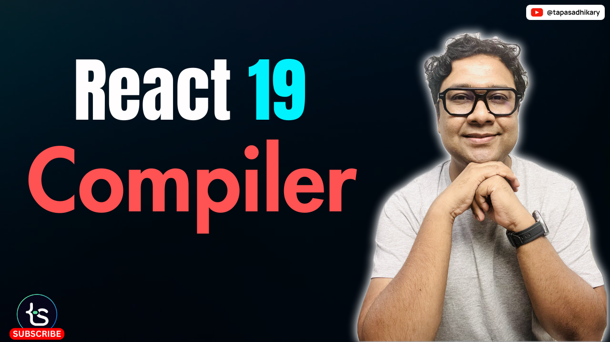

# React Compiler Lesson

This repository contains the code examples used in the React compiler video.

## Cheeck out the video tutorial

## Run it Locally

- Clone or fork the repo
- Install dependencies using `npm install` or `yarn install`
- Run it using `npm run dev` or `yarn dev`

The app will be available on `http://localhost:5173` by default.

## 🫶 Support
Liked it? You can show your support with a STAR(⭐).

> Many Thanks to all the `Stargazers` who have supported this project with stars(⭐)

### Sponsor My Work

> I am an independent educator and open-source enthusiast who creates meaningful projects to teach programming on my YouTube Channel. You can support my work by [sponsoring me on GitHub](https://github.com/sponsors/atapas).
